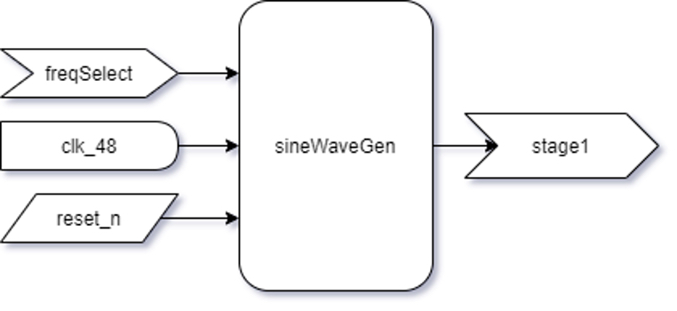
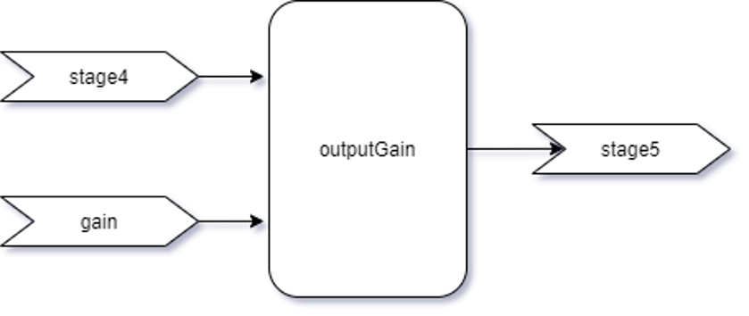

# FPGA Channel Strip
>A real-time FPGA audio processing channel strip, implemented using SystemVerilog for the DE0-Nano-SoC. Developed by John Matson and Igor Gasovic-Varga for BCIT's ELEX 7660, taught by Robert Trost.

## Usage
This is a hardware descritption project, designed for the FPGA in the the DE0-Nano-SoC. The system is designed to be used in combination with the AD1877 ADC and the AD1866 DAC, or in verification mode with a 4x4 keypad and an array of four 7-segment displays. The platform has been tested using ModelSim simulation software and verified and synthesized using Quartus Prime. The channel strip operates as a mono, stand-alone unit and should be used to process an individual line-level signal, such as guitar or vocal audio.

## Progress
Objective | Description | Status
--------- | ----------- | ------
Analog to digital conversion | Samples analog input signal to be processed digitally by the FPGA. An external IC in this case. | In progress
Digital to analog conversion | Converts digital output data to an analog signal. An external IC in this case. | Up next
High pass filter | A digital filter with the ability to pass higher-frequency signal components with little change in amplitude and low group delay while attenuating lower frequency signal components. Provides ability to adjust corner frequency. | Complete
Low pass filter | A digital filter with the ability to pass lower-frequency signal components with little change in amplitude and low group delay while attenuating higher frequency signal components. Provides ability to adjust corner frequency. | Complete
Equalizer | Provides ability to amplify or attenuate certain parts of a signal in the frequency domain without having to completely attenuate the way a high or low pass filter would. | Backlog
Compressor | Provides ability to attenuate the loudest parts of a signal while leaving quieter parts of the signal untouched. A type of dynamic processing. | Backlog
Phase flip | Provides ability to invert the signal, effectively performing a 180° phase shift. Useful for aligning multiple signals in time, such as top and bottom mics on a snare drum, for example. | Complete
Mute | Provides ability to toggle the output on and off. | Complete
Output gain | Provides ability to amplify or attenuate the signal before output. | Complete
Metering | Displays signal amplitude visually. For our purposes we display the difference in signal amplitude between output and input to channel strip. | Complete

## Contents
* [Executive Summary](#executive-summary)
* [Background](#background)
* [Technical Approach](#technical-approach)
* [Implementation](#implementation)
    * [Clocks](#clocks)
    * [Input Modules](#input-modules)
    * [Processing Modules](#processing-modules)
    * [Peripheral Modules](#peripheral-modules)
* [Conclusions & Future Work](#conclusions--future-work)

## Executive Summary
The design of audio processing systems which are suited to operate in live sound environments requires very low operational latency. FPGA chips are one of the best ways to meet this requirement. We were tasked with the completion of a self-directed project which applies the concepts covered in ELEX 7660 and chose to design an audio processing system capable of performing digital audio processing in real time. The product we set out to create was a single-channel audio processor with analog to digital conversion, several stages of processing, and a digital to analog conversion.

The final design includes modules for sine wave generation, low and high pass filtering, output gain control, muting, phase inversion, metering, and several other modules used to for the control of keypad and LED peripherals. One of the main advantages of the project is its ability to serve as a scalable platform. Once written, further stages of processing can easily be slotted in as desired, and – given the way in which FPGAs are well suited for parallel processing – additional channels could be added in parallel provided sufficient FPGA resources are available.

## Background
Behind the scenes of every concert and theatrical production is an intricate audio system most people take for granted. To emulate the sound of artists’ album recordings and create a meaningful experience for those in attendance, this audio system involves complex signal processing which is done using a live audio console. In broad terms, these consoles control signal flow and implement summing, filtering, and various types of dynamics processing, while processing effects, among other things. These consoles are organized by channel, each of which containing a number of user-controlled processing tools.

In the world of live audio, signal processing speed is essential. For this reason – although used to process audio in time-independent “studio” applications – software, especially software running on non-real-time operating systems (Windows, MacOS, Linux) is ill-suited for time-critical live audio processing. In industry, three solutions are common: analog circuitry, digital signal processors (DSPs), and field-programmable gate arrays (FPGAs). Analog circuitry – although beloved – has become largely obsolete due to its physical size, processing limitations, component fragility, etc. DSPs are very common in industry as they have the advantage of rapid signal processing, however they execute commands in serial – much like traditional processors – so scaling DSP based systems is costly because it requires multiple DSP units. Conversely, FPGAs are able to execute many parallel processes on a single chip which makes them an excellent choice for real-time audio processing.

Adaptating this idea for our project, we receive an audio signal as an input and sample it through the analog to digital converter (ADC). This digital signal is then transferred to the FPGA, where it is processed digitally before being sent through a digital to analog converter (DAC) and output to an audio jack.

## Technical Approach
Broadly speaking, we designed our system architecture by followed best practices for audio processing. Audio enters the system through an external audio-quality ADC. From there, audio is passed through a number of modules in sequence; a process known as signal flow. Each of these modules has several adjustable parameters, like the corner frequency of a filter for example. The ability to modify these parameters in real time allows for the device operator to hear the effects of different types of processing and adjust as needed. Finally, once the signal has passed through all stages of processing, the output level is metered and sent to the DAC.

In our design process, many of our specific decisions were made with audio quality in mind. Every digital signal processing application has a specified sampling rate and bit depth. Recording-caliber audio equipment typically employs a bit depth of at least 16. 24-bit systems are also common, but in the interest of conserving FPGA resources while maintaining professional-grade quality, we opted for 16-bit quantization, which provides a signal-to-noise ratio of 96dB.

The choice of sampling rate determines the frequency range that is captured with integrity. The human ear can hear frequencies as high as 20 kHz, and the Nyquist Theorem states that the sampling rate must be greater or equal to twice the highest frequency that is to be sampled – 40 kHz, in this case. Common professional-grade audio sampling frequencies are 44.1 kHz, 48 kHz, and 96 kHz. Higher sample rates do have a marginal effect on audio quality in capturing transitions with significant resolution. We opted for a sample rate of 48 kHz.

Another important design decision is the choice of filters. Digital filters are classified as either finite impulse response (FIR) or infinite impulse response (IIR). FIR filters have the advantage of linear phase and unconditional stability. On the other hand, IIR filters provide much better roll-off for the same number of taps. We specified a minimum roll off of 40 dB/decade which is achieved with a simple second order IIR filter, while the FIR equivalent requires far more taps for FIR and is actually not achievable at lower frequencies. The number of required taps is an important consideration when designing for FPGA, as each additional tap uses significant resources, which can really add up when considering a 16-bit system and for this reason, we opted for second order Butterworth IIR filters. The lack of linear phase is not ideal for an audio system, but fortunately the group delay in the passband is very low with the Butterworth filter topology.

## Implementation
### System Overview

The system layout is relatively straightforward. The design receives an audio input through the audio jack, converts it to a digitally sampled signal that the FPGA can manipulate, then converts it back to an analog signal to be output through another audio jack as a filtered audio signal. The netlist for the complete design is shown below.

### Clocks

The 50 MHz pin from the FPGA board is divided down to 48 kHz one of the FPGA’s build in phase locked loops (PLL). The 48 kHz clock is used throughout the system.

### Input Modules
#### Sine Wave Generator

The sinWaveGen module uses the 48kHz clock along with the freqSelect from the keypad input to select and output a sampled sine wave at one of the internally generated frequencies as the stage1 signal.

Since we were not able to use the ADC to provide an input signal, we opted to create the sineWaveGen module, which contains data for one period of a 48kHz sampled sine wave at frequencies of: 100 Hz, 250 Hz, 500 Hz, 1 kHz, 2.5 kHz, 5 kHz, and 10 kHz. These digital waveforms were created with a MATLAB script that would output each value in a formatted line to match the requirements of our code.

The module cycles through the sine wave data with a state machine. Each frequency has its own state machine, and a case statement is used to select the appropriate one based on the freqSelect input. These state machines are clocked at 48 kHz. The module also has the ability to supress output if freqSelect is 0.

#### ADC
This module is currently in progress.

### Processing Modules
#### Low Pass Filter

The lowpass module receives the stage1 signal as an input from sineWaveGen, along with the lowpassSelect which determines which filter coefficients are used. The set of coefficients then determines the cut-off frequency of the filter. The clock is used to update and execute the difference equation which is output as the stage2 signal.

The lowpass module stores the coefficients for a 1 kHz, 2.5 kHz, 5 kHz, 10 kHz lowpass filters, and an all-pass filter which effectively bypasses the filter (albeit with finite latency). The module includes a combinational block which transfers the received input signal to a 64-bit variable. The combinational block also reduces the calculated value to be output from the filter to a 16-bit variable, clipping values which exceed the 16-bit full scale range and a case statement which selects filter coefficients based on the lowpassSelect input.

We also used two sequential blocks. The first implements the rotation of the difference equation’s FIFO buffer, which executes on the positive edge of the clock in addition to an asynchronous reset. The second block executes the difference equation on the negative edge of the clock. By executing on the negative clock edge, we ensure that the correct difference equation is set up before the result is calculated. This could also be performed in a combinational block, but if each buffer value is not updated at precisely the same time, there remains the possibility for a transient condition at the output of the filter which would degrade audio quality.

#### High Pass Filter

Similar to the lowpass filter, the highpass module receives the stage2 signal along with highpassSelect, while using the selected filter coefficients in the difference equation to output the stage3 signal. The highpass module is almost identical to the lowpass, with the only difference being coefficients that correspond to 100 Hz, 250 Hz, 500 Hz and 1 kHz corner frequencies.

#### Phase Flip

The phase module multiplies the stage3 input signal by -1 when active, which effectively flips the phase of the signal when activated by the phase input. This is executed combinatorically.

#### Output Gain

The outputGain module provides the ability to adjust the amplitude of the signal before it passes through the mute module and leaves the device. In a combinational block, the 16-bit input signal is multiplied by the 16-bit gain input. A gain value of 'b0001000000000000 corresponds to 0 dB, so it follows that gain values higher than that amplify the signal linearly, while values less than that perform linear attenuation. To avoid truncation, the module performs this multiplication with 32-bit logic, and clips signal that are larger than 16-bit full scale before down-converting to 16-bit for output.

#### Mute

When the mute input is high, the mute module supresses output. When mute is low, the module passes the input (stage5) through to the output (stage6) untouched. This process is executed combinatorically.

### Output Modules
#### Output Level Metering Conversion

The outputLevel module receives the original sine wave as stage1, and the final processed sine wave – having passed through all stages of processing – as stage6. It determines the maximum value from both waves every 12,000 samples and takes a ratio of stage6/stage1, then outputs this ratio value with four significant figures of resoultion.

Originally, this module was designed to take the RMS value of stage1 and stage6, then compute the ratio in dB. While these functions worked in ModelSim, the log and square root functions are not synthesizable in Quartus, so due to timeline limitations, we decided to show the ratio of the stage1 to stage6 waves by recording the largest value in the 12’000 most recent samples, and simply take a ratio of the two numbers. We realize that this method is not highly accurate for digital signals, especially in frequencies closer to half our sampling rate, and for this reason, we intend to improve our metering implementation in the future.

In a combinational block, we update the maximum value of both inputs continually, until we reach a count of 12,000. The ratio is then taken and multiplied by 1000 in order to scale to the four 7-segment displays that are available. A combinational block then uses a series of for loops to break down this number into each of the 4 digits, which are the outputs of the module.

#### DAC
This module is currently in progress.

### Peripheral Modules
#### 2x4 LED Sequencing Decoder

The decode2 module simply takes the value from a 2-bit counter in our top-level entity and decodes to a 4-bit output to produce an enable signal for the 7-segment displays. This module was originally developed for the second lab of ELEX 7660.

#### Display Multiplexer

The displayMux module receives the values of the numbers given from the ratio of the initial and final sine waves, along with digit from the 2-bit counter. It multiplexes this information to output the correct digit of the 7-segment display array at the same time that digit is enabled in the decode2 module. This module also checks if the current number is the first digit and activates the decimal output which is received by the decode7 module to activate the decimal point on the first 7-segment display. The displayMux module is a modified version of the bcitid module created for ELEX 7660 lab 1.

#### 4x7 LED Value Decoder

The decode7 module receives the number value to be sent to the display and uses a case statement to decode to the 7-bit binary output logic needed to activate the correct display segments. The module also performs a bitwise AND with the 7-bit signal needed to turn on the decimal point when the decimal input is active, which effectively OR’s the two signals since the 7-segment display is active low. The decode7 module is a modified version of the one used for several ELEX 7660 labs with added decimal functionality.

#### 8x4 Keypad Encoder

The kpdecode module receives the kpc input from the colseq module, and the kpr input from the keypad. It decodes the column and row signals for the keypad to output the number of the button that was pressed. This logic is implemented combinatorically using nested case statements. The kpdecode module is identical to the one used in several ELEX 7660 labs.

#### 4x9 Button Decoder

The decodeButton module decodes the button number as received from kpdecode to the corresponding selection function for freqSelect, lowpassSelect, and highpassSelect, which determine the frequency of the input wave, and the cut-off frequencies of the filters. This module is implemented using sequential logic, clocked at 48 kHz, to provide the ability to latch the outputs when no button is being pressed.

#### LED Column Sequencer

The colseq module receives the kpr input, and outputs kpc. These refer to the keypad columns and rows which are used in the kpdecode module to determine which button is being pressed. The module uses sequential logic, clocked at 48 kHz, to sequence the 4-bit keypad column output. The colseq module is identical to the one used in several ELEX 7660 labs.

## Conclusions & Future Work
We originally set out to create a real-time single channel audio processor with an FPGA at the heart of the design to perform the digital processing, accompanied by an ADC and DAC for I/O. With recently learned course material from ELEX 7660 - Digital System Design and ELEX 7620 - Signal Processing and Filters, we were able to implement a chain of digital audio processing with digital logic on the FPGA. Due to the Covid-19 pandemic, we were unable to access the lab equipment required to integrate the ADC and DAC, however, we made use of FPGA and several DE0-Nano-SoC peripherals to demonstrate the functionality of the channel strip.

In terms of ongoing developmemt, integrating a working ADC and DAC is a top priority. Additional processing modules including compression and equalization are also among the top priorities, although the addition of an external control and monitoring unit will likely take precedence. Although the FPGA platform is excellent for low-latency parallel processing, user-interface elements are very difficult to develop for FPGA. As such, we turn to the Raspberry Pi platform where the user will be able to control channel strip parameters and view metering information, leaving the FPGA to handle the low-level signal processing. Once these changes have been implemented, we can focus on the integration of additional audio channels. Stay tuned for continued development.
